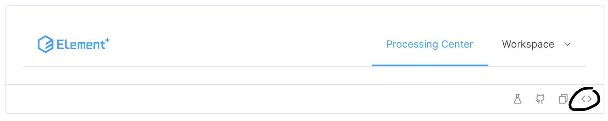

# 前端代码说明

此说明为 B 站: InkkaPlum 频道的相关教程所用, 仅供学习。不得二次用于任何机构/个人再次录制 Vue/Node/Element 或其它任何语言, 框架, 架构, 工具等等教程中。

测试代码需要自己配置输入对应命令配置对应环境!

```bash
npm i
npm install pinia element-plus axios --save
npm install vue-router@4
```

## 欢迎改进成一个更加可扩展的项目

之前说明指出了不可商用, 但是非常欢迎修改项目或者添加更多功能。这个项目只是实现了基本的功能, 也有很多未完成的点。

能否利用相关库, 自己实现 API, 让其展示最近的汇率走势。

文章能否实现收藏功能, 或者点赞功能, 当然更远地, 能否完成评论的发布和投稿功能的实现。

此外, 需要让该站点变得更安全需要更多的改变, 感兴趣欢迎以此项目为媒介探索 Vue 乃至后端的开发。

## 架构

```html
client/ |-- src/ | |-- assets/ | |-- components/ | | |-- Login.vue | | |--
Register.vue | |-- router/ | | |-- index.ts | |-- store/ | | |-- auth.ts | |--
views/ | | |-- CurrencyExchangeView.vue | | |-- HomeView.vue | | |--
NewsDetailView.vue | | |-- NewsView.vue | |-- App.vue | |-- axios.ts | |--
main.ts | |-- shims-vue.d.ts | |-- vite-env.d.ts |-- package.json |--
tsconfig.json |-- vite.config.ts |-- index.html
```

## 配置过程

1. 创建项目

在 client 上一级目录, 如 myApp 输入

```bash
npm create vite@latest client -- --template vue-ts
```

然后`cd client`, 并且输入

```bash
npm i
```

2. 安装对应工具

```bash
npm install pinia element-plus axios --save
```

`--save`将添加到 package.json 中的 Dependencies 里面。

同时, 需要一个 shims-vue.d.ts 文件为.vue 提供类型声明。

```ts
declare module "*.vue" {
  import { DefineComponent } from "vue";
  const component: DefineComponent<{}, {}, any>;
  export default component;
}
```

3. 我们首先看一下最后的实现结果, 并且完成导航栏的制作。(App.vue 内)

首先, 我们参考官方文档, main.ts 内

我们直接完整导入, 实际上而言建议按需导入, 可能更加好一点。但是这里我们为了减小时间, 直接地`import...`

这些直接看官方文档即可, 为了方便各位, 直接在这里导入就行。

```ts
import { createApp } from "vue";
import App from "./App.vue";
import ElementPlus from "element-plus";
import "element-plus/dist/index.css";

const app = createApp(App);
app.use(ElementPlus);
app.mount("#app");
```

更多的环境配置直接看官网即可。

## 开始写代码!

首先, 我们需要挑选合适的组件做一个顶部导航栏
在 elementPlus 官网查看合适的方法:

官网=> 组件=> 下滑至导航=> menu 菜单。

这样地查看源代码:



解释:

a. ellipsis 当你内容过多页面放不下的情况下就会有个三点形式的省略号。
b. 需要有一个合适的容器。

```js
<template>
    <el-container>
        <el-header>
  <el-menu
    :default-active="activeIndex"
    class="el-menu-demo"
    mode="horizontal"
    :ellipsis="false"
    @select="handleSelect"
  >
   <el-menu-item index="home">首页</el-menu-item>
        <el-menu-item index="currencyExchange">兑换货币</el-menu-item>
        <el-menu-item index="news">查看新闻</el-menu-item>
        <el-menu-item index="login">登录</el-menu-item>
        <el-menu-item index="register">注册</el-menu-item>
        <el-menu-item index="logout">退出</el-menu-item>
  </el-menu>
  </el-header>
    <el-main>
        </el-main>
  </el-container>
</template>

<script lang="ts" setup>
import { ref } from 'vue'

const activeIndex = ref('home')
const handleSelect = (key: string, keyPath: string[]) => {
  console.log(key, keyPath)
}
</script>
```

然后, 我们配置路由, 首先让各个页面都有内容。基于目录架构, 在 views 文件中新建对应文件。

然后我们查看官方文档的案例

index.js

```js
import { createMemoryHistory, createRouter } from "vue-router";

import HomeView from "./HomeView.vue";
import AboutView from "./AboutView.vue";

const routes = [
  { path: "/", component: HomeView },
  { path: "/about", component: AboutView },
];

const router = createRouter({
  history: createMemoryHistory(),
  routes,
});
```

Router 实例由 createRouter 创建。我们首先就需要将这里的 createMemoryHistory()改成 createWebHistory()
createWebHistory: 这是用于创建基于 HTML5 历史模式的路由器历史的函数。HTML5 历史模式使用浏览器的`history.pushState`和`history.replaceState` API 来管理 URL, 而不是使用传统的 URL 哈希（#）。

类型: RouteRecordRaw

最终参考

- 这是最终代码, 如果直接复制会有问题, 请参考视频进行修改。

```ts
import { createRouter, createWebHistory, RouteRecordRaw } from "vue-router";
import HomeView from "../views/HomeView.vue";
import CurrencyExchangeView from "../views/CurrencyExchangeView.vue";
import NewsView from "../views/NewsView.vue";
import NewsDetailView from "../views/NewsDetailView.vue";
import Login from "../components/Login.vue";
import Register from "../components/Register.vue";

const routes: RouteRecordRaw[] = [
  { path: "/", name: "Home", component: HomeView },
  {
    path: "/exchange",
    name: "CurrencyExchange",
    component: CurrencyExchangeView,
  },
  { path: "/news", name: "News", component: NewsView },
  { path: "/news/:id", name: "NewsDetail", component: NewsDetailView },
  { path: "/login", name: "Login", component: Login },
  { path: "/register", name: "Register", component: Register },
];

const router = createRouter({
  history: createWebHistory(),
  routes,
});
```

按照官方文档, 在 app.vue 导入对应内容

```ts
import { useRouter, useRoute } from "vue-router";
```

具体实现需要等完成了 HomeView.vue, CurrencyExchangeView.vue, 基本的页面查看功能后才可以继续完成配置。

HomeView.vue
这个代码没有任何重要的地方, 直接复制即可

```vue
<template>
  <el-container class="home-container">
    <div class="content-wrapper">
      <h1 class="title">欢迎使用蓝鼠兑换</h1>
      <p class="description">请选择上方的功能进行操作。</p>
    </div>
  </el-container>
</template>

<script setup lang="ts"></script>
```

CurrencyExchangeView.vue

这个代码我们首先需要实现一个表单, 那么我们需要去 ElementPlus 官方文档上查看适合的选择。
我们找到 el-form 即可

```vue
<template>
  <el-form :model="form" label-width="auto" style="max-width: 600px">
    <el-form-item label="Activity name">
      <el-input v-model="form.name" />
    </el-form-item>
    <el-form-item label="Activity zone">
      <el-select v-model="form.region" placeholder="please select your zone">
        <el-option label="Zone one" value="shanghai" />
        <el-option label="Zone two" value="beijing" />
      </el-select>
    </el-form-item>
    <el-form-item label="Activity time">
      <el-col :span="11">
        <el-date-picker
          v-model="form.date1"
          type="date"
          placeholder="Pick a date"
          style="width: 100%"
        />
      </el-col>
      <el-col :span="2" class="text-center">
        <span class="text-gray-500">-</span>
      </el-col>
      <el-col :span="11">
        <el-time-picker
          v-model="form.date2"
          placeholder="Pick a time"
          style="width: 100%"
        />
      </el-col>
    </el-form-item>
    <el-form-item label="Instant delivery">
      <el-switch v-model="form.delivery" />
    </el-form-item>
    <el-form-item label="Activity type">
      <el-checkbox-group v-model="form.type">
        <el-checkbox value="Online activities" name="type">
          Online activities
        </el-checkbox>
        <el-checkbox value="Promotion activities" name="type">
          Promotion activities
        </el-checkbox>
        <el-checkbox value="Offline activities" name="type">
          Offline activities
        </el-checkbox>
        <el-checkbox value="Simple brand exposure" name="type">
          Simple brand exposure
        </el-checkbox>
      </el-checkbox-group>
    </el-form-item>
    <el-form-item label="Resources">
      <el-radio-group v-model="form.resource">
        <el-radio value="Sponsor">Sponsor</el-radio>
        <el-radio value="Venue">Venue</el-radio>
      </el-radio-group>
    </el-form-item>
    <el-form-item label="Activity form">
      <el-input v-model="form.desc" type="textarea" />
    </el-form-item>
    <el-form-item>
      <el-button type="primary" @click="onSubmit">Create</el-button>
      <el-button>Cancel</el-button>
    </el-form-item>
  </el-form>
</template>

<script lang="ts" setup>
import { reactive } from "vue";

// do not use same name with ref
const form = reactive({
  name: "",
  region: "",
  date1: "",
  date2: "",
  delivery: false,
  type: [],
  resource: "",
  desc: "",
});

const onSubmit = () => {
  console.log("submit!");
};
</script>
```

我们复制模板代码

```html
<template>
  <el-container>
    <el-form :model="form" class="exchange-form">
      <el-form-item label="从货币" label-width="80px">
        <el-select v-model="form.fromCurrency" placeholder="选择货币">
          <el-option :label="currency" :value="currency" />
        </el-select>
      </el-form-item>
      <el-form-item label="到货币" label-width="80px">
        <el-select v-model="form.toCurrency" placeholder="选择货币">
          <el-option :label="currency" :value="currency" />
        </el-select>
      </el-form-item>
      <el-form-item label="金额" label-width="80px">
        <el-input v-model="form.amount" type="number" placeholder="输入金额" />
      </el-form-item>
      <el-form-item>
        <el-button type="primary">兑换</el-button>
      </el-form-item>
    </el-form>
    <div class="result">
      <p>兑换结果:0</p>
    </div>
  </el-container>
</template>
```

配置 axios。

```bash
npm i axios
```

新建一个 axios.ts 文件。

JWT token 攻略:

```js
client.interceptors.request.use(
  (config) => {
    if (config.authorization !== false) {
      const token = getCurrentAccessToken();
      if (token) {
        config.headers.Authorization = "Bearer " + token;
      }
    }
    return config;
  },
  (error) => {
    return Promise.reject(error);
  }
);
```

最终代码:

```ts
import axios from "axios";

const instance = axios.create({
  baseURL: "http://localhost:3000/api",
});

instance.interceptors.request.use((config) => {
  const token = localStorage.getItem("token");
  if (token) {
    config.headers.Authorization = "Bearer " + token;
  }
  return config;
});

export default instance;
```

同时改变 vite.config.ts 解决跨域问题

```ts
import { defineConfig } from "vite";
import vue from "@vitejs/plugin-vue";

export default defineConfig({
  plugins: [vue()],
  server: {
    proxy: {
      "/api": {
        target: "http://localhost:3000",
        changeOrigin: true,
        secure: false,
        rewrite: (path) => path.replace(/^\/api/, ""),
      },
    },
  },
});
```

最终代码:

```ts
import { ref, onMounted } from "vue";
import axios from "../axios";

interface ExchangeRate {
  fromCurrency: string;
  toCurrency: string;
  rate: number;
}

const form = ref({
  fromCurrency: "",
  toCurrency: "",
  amount: 0,
});

const result = ref<number | null>(null);
const currencies = ref<string[]>([]);
const rates = ref<ExchangeRate[]>([]);

const fetchCurrencies = async () => {
  const response = await axios.get<ExchangeRate[]>("/exchangeRates");
  rates.value = response.data;
  currencies.value = [
    ...new Set(
      response.data
        .map((rate: ExchangeRate) => [rate.fromCurrency, rate.toCurrency])
        .flat()
    ),
  ];
};

const exchange = () => {
  const rate = rates.value.find(
    (rate) =>
      rate.fromCurrency === form.value.fromCurrency &&
      rate.toCurrency === form.value.toCurrency
  )?.rate;

  if (rate) {
    result.value = form.value.amount * rate;
  } else {
    result.value = null;
  }
};

onMounted(fetchCurrencies);
```

实现新闻页:

组件: 我们需要一个卡片

案例:

```html
<template>
  <el-card style="max-width: 480px">
    <template #header>
      <div class="card-header">
        <span>Card name</span>
      </div>
    </template>
    <p v-for="o in 4" :key="o" class="text item">{{ 'List item ' + o }}</p>
    <template #footer>Footer content</template>
  </el-card>
</template>
```

button 文本按钮配置:

```html
<el-button
  v-for="button in buttons"
  :key="button.text"
  :type="button.type"
  text
  bg
></el-button>
```

简单实现:

```html
<div>
  <el-card class="article-card">
    <h2>标题</h2>
    <p>预览</p>
    <el-button text>阅读更多</el-button>
  </el-card>
</div>
<div class="no-data">No data</div>
```

最终实现:

```vue
<template>
  <el-container>
    <el-main>
      <div v-if="articles && articles.length">
        <el-card
          v-for="article in articles"
          :key="article._id"
          class="article-card"
        >
          <h2>{{ article.title }}</h2>
          <p>{{ article.preview }}</p>
          <el-button text>阅读更多</el-button>
        </el-card>
      </div>
      <div v-else class="no-data">No data</div>
    </el-main>
  </el-container>
</template>

<script setup lang="ts">
import { ref, onMounted } from "vue";
import axios from "../axios";

interface Article {
  _id: string;
  title: string;
  preview: string;
  content: string;
}

const articles = ref<Article[]>([]);

const fetchArticles = async () => {
  try {
    const response = await axios.get<Article[]>("/articles");
    articles.value = response.data;
  } catch (error) {
    console.error("Failed to load articles:", error);
  }
};

onMounted(fetchArticles);
</script>
```

然后我们需要具体地配置路由:

```ts
import { useRouter, useRoute } from "vue-router";
const router = useRouter();
const route = useRoute();
```

App.vue 阶段性过程

```ts
import { ref, watch } from "vue";
import { useRouter, useRoute } from "vue-router";

const router = useRouter();
const route = useRoute();

const activeIndex = ref(route.name?.toString() || "home");

watch(route, (newRoute) => {
  activeIndex.value = newRoute.name?.toString() || "home";
});

const handleSelect = (key: string) => {
  router.push({
    name: key.charAt(0).toUpperCase() + key.slice(1),
  });
};
```

实现登录/注册页面和对应功能:

componennts/login.vue

参考表单:

```html
<template>
  <div class="auth-container">
    <el-form :model="form" class="auth-form">
      <el-form-item label="用户名" label-width="80px">
        <el-input placeholder="请输入用户名" />
      </el-form-item>
      <el-form-item label="密码" label-width="80px">
        <el-input type="password" placeholder="请输入密码" />
      </el-form-item>
      <el-form-item>
        <el-button type="primary" native-type="submit">登录</el-button>
      </el-form-item>
    </el-form>
  </div>
</template>
```

注册就是把登录改成注册即可。

接下来我们修改路由就把之前的完整代码复制一下即可。

完善 App.vue

```html
<el-menu-item index="login" v-if="!authStore.isAuthenticated"
  >登录</el-menu-item
>
<el-menu-item index="register" v-if="!authStore.isAuthenticated"
  >注册</el-menu-item
>
```

实现具体的注册逻辑:

完成代码:

```ts
const register = async () => {
  const username: string = form.value.username;
  const password: string = form.value.password;

  // 发送注册请求
  const response = await axios.post("/auth/register", { username, password });

  // 存储 token
  // 测试代码
  console.log(response);
  //data.token
  token.value = response.data.token;
  localStorage.setItem("token", token.value || "");

  // 跳转到新闻页面
  router.push({ name: "News" });
};
```

登录页模板

```html
<template>
  <div class="auth-container">
    <el-form :model="form" class="auth-form" @submit.prevent="login">
      <el-form-item label="用户名" label-width="80px">
        <el-input v-model="form.username" placeholder="请输入用户名" />
      </el-form-item>
      <el-form-item label="密码" label-width="80px">
        <el-input
          v-model="form.password"
          type="password"
          placeholder="请输入密码"
        />
      </el-form-item>
      <el-form-item>
        <el-button type="primary" native-type="submit">登录</el-button>
      </el-form-item>
    </el-form>
  </div>
</template>
```

auth.ts 中注册部分

```ts
const register = async (username: string, password: string) => {
  try {
    const response = await axios.post("/auth/register", { username, password });
    token.value = response.data.token;
    localStorage.setItem("token", token.value || "");
  } catch (error) {
    console.error("Register error:", error);
  }
};
```

错误提示案例:

```ts
ElMessage.error("Oops, this is a error message.");
```

注册最终案例:

```ts
const register = async () => {
  try {
    await authStore.register(form.value.username, form.value.password);
    router.push({ name: "News" });
  } catch {
    ElMessage.error("注册失败，请重试。");
  }
};
```

App.vue 导航栏最终案例:

```html
<el-menu-item index="login" v-if="!authStore.isAuthenticated"
  >登录</el-menu-item
>
<el-menu-item index="register" v-if="!authStore.isAuthenticated"
  >注册</el-menu-item
>
<el-menu-item index="logout" v-if="authStore.isAuthenticated"
  >退出</el-menu-item
>
```

文章权限实现说明

`authStore.isAuthenticated` => `false` 说明未登录

`!authStore.isAuthenticated` => `true` 说明未登录, 所以会执行下面的错误提示。

具体代码

```ts
const viewDetail = (id: string) => {
  if (!authStore.isAuthenticated) {
    ElMessage.error("请先登录后再查看");
    return;
  }
  router.push({ name: "NewsDetail", params: { id } });
};
```

文章具体页面

```vue
<template>
  <el-container>
    <el-main>
      <el-card v-if="article" class="article-detail">
        <h1>{{ article.title }}</h1>
        <p>{{ article.content }}</p>
      </el-card>
      <div v-else class="no-data">文章不存在</div>
    </el-main>
  </el-container>
</template>

<script setup lang="ts">
import { ref, onMounted } from "vue";
import { useRoute } from "vue-router";
import axios from "../axios";

interface Article {
  _id: string;
  title: string;
  content: string;
}

const article = ref<Article | null>(null);
const route = useRoute();

const fetchArticle = async () => {
  const { id } = route.params;
  try {
    const response = await axios.get<Article>(`/articles/${id}`);
    article.value = response.data;
  } catch (error) {
    console.error("Failed to load article:", error);
  }
};

onMounted(fetchArticle);
</script>

<style scoped>
.article-detail {
  margin: 20px 0;
}

.no-data {
  text-align: center;
  font-size: 1.2em;
  color: #999;
}
</style>
```

## 莫名其妙的报错

莫名其妙的报错指编辑器总是说找不到文件/对应的类型声明, 这个时候修改 tsconfig 就很重要了。然后重新启动(`npm run dev`)直接用下面的即可, 假如依然不行, 私信联系 UP 主即可, 因为还有几个对策, 但是没有写出来。

vue文件的类型声明 shims-vue.d.ts

```ts
declare module '*.vue' {
    import { DefineComponent } from 'vue';
    const component: DefineComponent<{}, {}, any>;
    export default component;
  }
```

```json
{
  "compilerOptions": {
    "target": "esnext",
    "module": "esnext",
    "strict": true,
    "jsx": "preserve",
    "moduleResolution": "node",
    "resolveJsonModule": true,
    "esModuleInterop": true,
    "skipLibCheck": true,
    "forceConsistentCasingInFileNames": true,
    "baseUrl": ".",
    "paths": {
      "@/*": ["src/*"]
    },
    "types": ["vite/client"]
  },
  "include": ["src/**/*.ts", "src/**/*.d.ts", "src/**/*.tsx", "src/**/*.vue"]
}
```

## CSS 文件

为了节约 CSS 时间, 我们 CSS 文件都不会写。以下是每个文件的 CSS

currencyExchangeView.vue

```css
.exchange-form {
  width: 100%;
  max-width: 600px;
  margin: 20px auto;
  padding: 20px;
  background-color: #f5f5f5;
  border-radius: 4px;
  box-shadow: 0 2px 4px rgba(0, 0, 0, 0.1);
}

.result {
  margin-top: 20px;
  padding: 20px;
  background-color: #f0f0f0;
  border-radius: 4px;
  text-align: center;
  font-size: 18px;
}
```

Homeview.vue

```css
.home-container {
  display: flex;
  justify-content: center;
  align-items: center;
  height: 100vh;
  background-color: #f5f5f5;
  padding: 20px;
  box-sizing: border-box;
}

.content-wrapper {
  text-align: center;
  max-width: 800px;
}

.title {
  color: #333;
  font-size: 36px;
  font-weight: bold;
  margin-bottom: 20px;
}

.description {
  color: #666;
  font-size: 18px;
  line-height: 1.5;
}
```

newsView.css

```css
.article-card {
  margin: 20px 0;
}

.no-data {
  text-align: center;
  font-size: 1.2em;
  color: #999;
}
```

app.vue

```css
.el-menu-demo {
  line-height: 60px;
}
```

login.vue

```css
.auth-container {
  display: flex;
  justify-content: center;
  align-items: center;
  height: 100vh;
  background-color: #f5f5f5;
  padding: 20px;
  box-sizing: border-box;
}

.auth-form {
  width: 100%;
  max-width: 360px;
  padding: 20px;
  background-color: #fff;
  border-radius: 4px;
  box-shadow: 0 2px 4px rgba(0, 0, 0, 0.1);
}
```

register.vue

```css
.auth-container {
  display: flex;
  justify-content: center;
  align-items: center;
  height: 100vh;
  background-color: #f5f5f5;
  padding: 20px;
  box-sizing: border-box;
}

.auth-form {
  width: 100%;
  max-width: 360px;
  padding: 20px;
  background-color: #fff;
  border-radius: 4px;
  box-shadow: 0 2px 4px rgba(0, 0, 0, 0.1);
}
```

补:
newsDetailView.vue

```css
.article-detail {
  margin: 20px 0;
}

.no-data {
  text-align: center;
  font-size: 1.2em;
  color: #999;
}
```

## 总结

以上就是全部内容, 如果有任何问题, 欢迎私信 UP 主反馈!

以上 祝学习成功!

Inkka Plum
