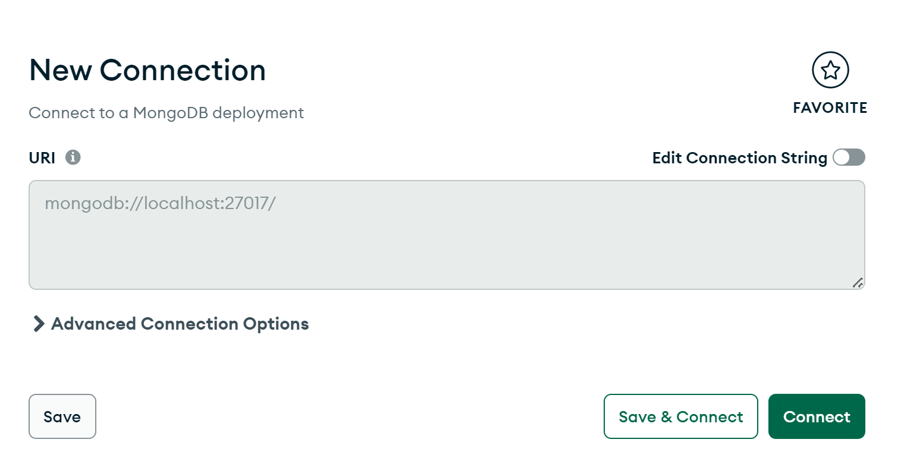

# 后端配置说明

此说明为 B 站: InkkaPlum 频道的相关教程所用, 仅供学习。不得二次用于任何机构/个人再次录制 Vue/Node/Element 或其它任何语言, 框架, 架构, 工具等等教程中。但是非常欢迎修改项目或者添加更多功能。这个项目只是实现了基本的功能, 也有很多未完成的点。
此外, 下文有任何问题或者需要改进的点, 请联系 UP 主。

## 架构

```html
server/ 
|-- src/ 
| |-- controllers/ 
| | |-- articleController.ts 
| | |-- authController.ts 
| | |-- exchangeRateController.ts 
| |-- middlewares/ 
| | |-- authMiddleware.ts 
| |-- models/ 
| | |-- Article.ts 
| | |-- ExchangeRate.ts 
| | |-- User.ts 
| |-- routes/ 
| | |-- article.ts 
| | |-- auth.ts 
| | |-- exchangeRate.ts 
| |-- app.ts 
| |-- index.ts 
|-- package.json 
|-- tsconfig.json
```

## 配置说明

1. 配置相关依赖。

在 server 目录下:(不是 server 的话需要 cd server)

```bash
npm i 
```

2. 本地安装对应程序

a. [MongoDB](https://www.mongodb.com/)

下载[Community Edition](https://www.mongodb.com/try/download/community)

配置 GUI(图形用户界面)

Products => Compass

或者直接点击[链接](https://www.mongodb.com/products/tools/compass)

b. [Postman](https://www.postman.com/)
你需要注册一个账号

下载 Postman, [链接](https://www.postman.com/downloads/)

## 运行说明

1. 启动服务器, 需要查看 json 里面的内容。

```json
"scripts": {
    "start": "ts-node src/index.ts",
    "dev": "ts-node-dev src/index.ts"
  },
```

```cmd
npm run dev
```

即可, 需要看到

```cmd
Server is running on port 3000
```

就说明成功了, 如果有 ERROR 消息, 请私信联系 UP 主。

2. 测试 API

点击加号即可


然后点击 GET/POST。

首先需要注册一个账号

POST

地址:
http://localhost:3000/api/auth/register

输入样式

```json
{
  "username": "自己写名字",
  "password": "自己写密码"
}
```

返回的是你的 token:

```json
{
  "token": "你的token"
}
```

把这个 token 复制下来, 点击 header, 键名叫 authorization, 键值即为 token


然后即可添加汇率, 和文章。

a. 添加文章

地址: 用 POST
http://localhost:3000/api/articles

内容:

```json
{
"title": "随意添加文本",
"content": "文章内容",
"preview": "文章预览内容",
},
```

b. 返回数据

地址: 用 GET
http://localhost:3000/api/articles

案例:

```json
[
  {
    "_id": "114514",
    "title": "随意添加文本",
    "content": "文章内容",
    "preview": "文章预览内容",
    "createdBy": "114514",
    "__v": 0
  }
]
```

c. 添加汇率

地址: 用 POST
http://localhost:3000/api/exchangeRates

```json
{
    "fromCurrency": "USD",
    "toCurrency": "EUR",
    "rate": 1.1,      
},
```

d. 返回数据

地址无异, 用GET即可。

案例: 

```json
[
    {
        "_id": "114514",
        "fromCurrency": "USD",
        "toCurrency": "EUR",
        "rate": 1.1,
        "date": "1145-01-14T01:14:51.870Z",
        "__v": 0
    },
]
```

e. 登录

用POST
http://localhost:3000/api/auth/login

```json
{
  "username": "自己的名字",
  "password": "自己的密码"
}
```

返回token:

```json
{
  "token": "你的token"
}
```

## 修改说明

核心代码

```ts
 await mongoose.connect('mongodb://localhost:27017/currencyeg', {
      useNewUrlParser: true,
      useUnifiedTopology: true,
    } as ConnectOptions);
    console.log('Connected to MongoDB');
```

`currencyeg`可以随便修改, 其它不要动即可。

点击Connect



然后既可以修改数据


代码请直接从GitHub上下载下来即可。

以上就是全部内容, 如果有任何问题, 欢迎私信UP主反馈!

以上 祝学习成功!

Inkka Plum
